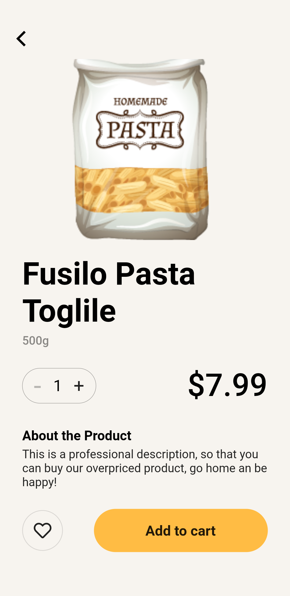
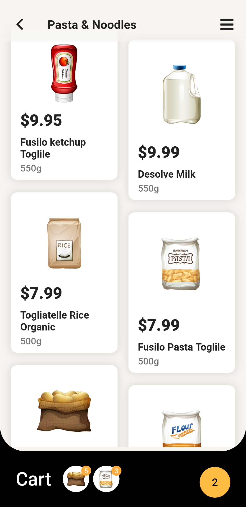
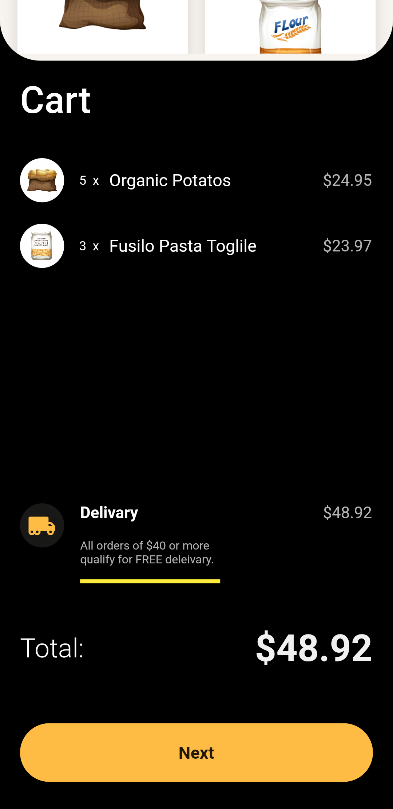
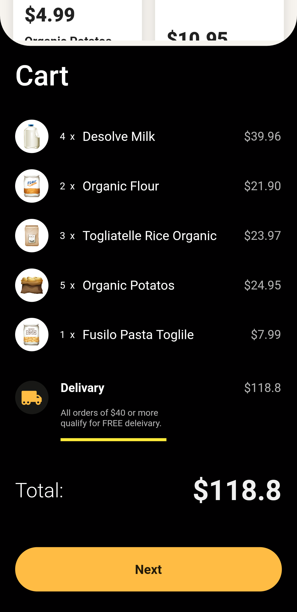
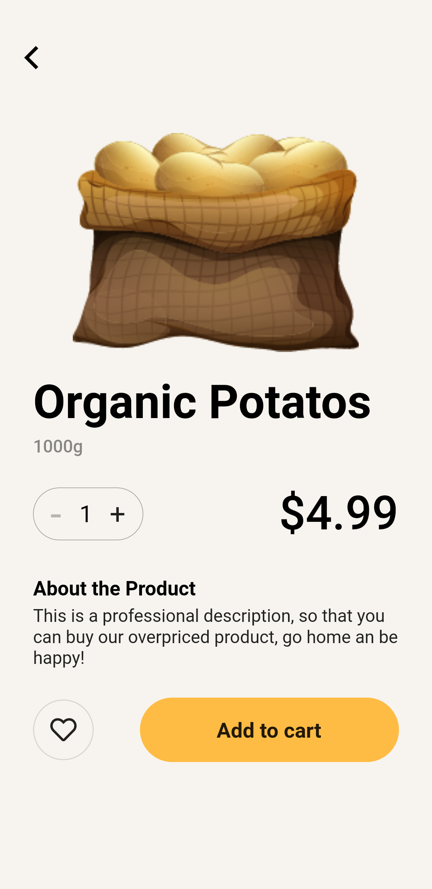
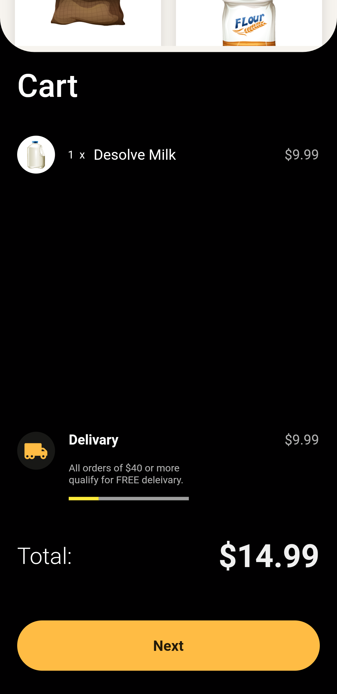
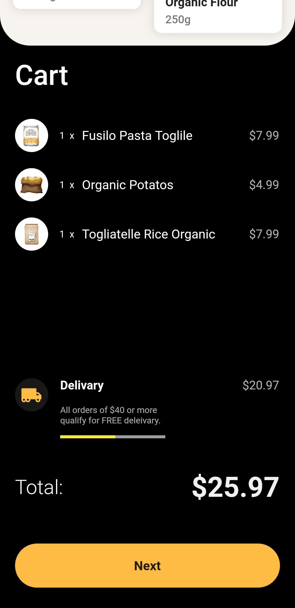
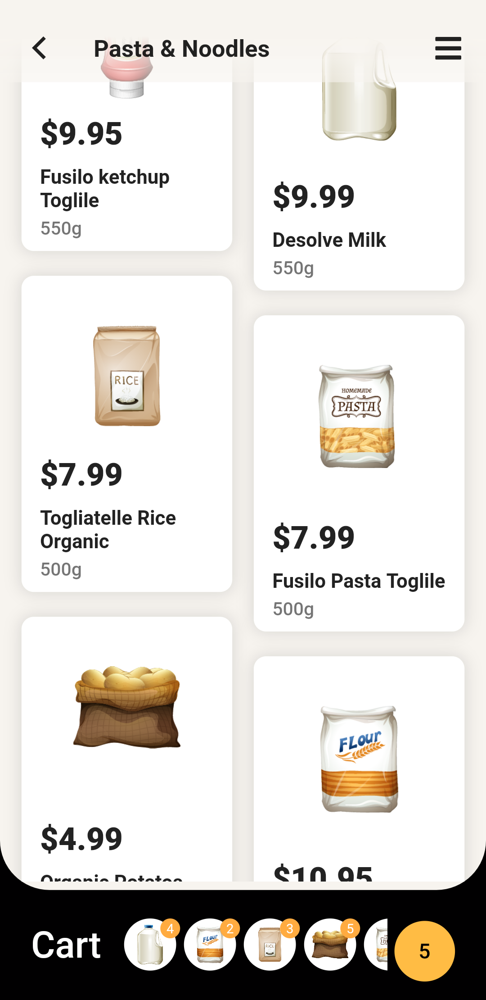
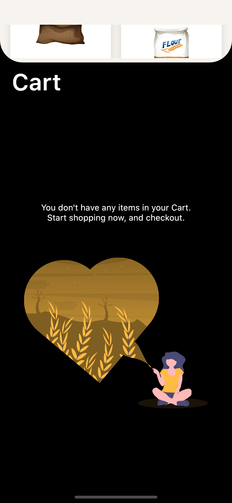
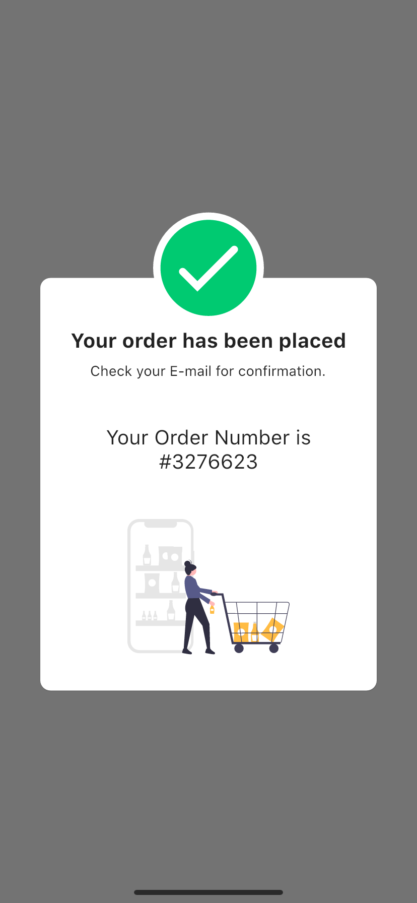

# Groceries Shopping App

This amazing App UI is built on the amazing design of [Cuberto](https://dribbble.com/cuberto "Cuberto").

- Original UI design: [Here](https://dribbble.com/shots/6120171-Groceries-Shopping-App-Interaction "Original Design URL")
- For more Flutter apps: [From Here](https://github.com/AhmedAbouelkher "profile")
- Video/Live Demo: [From Here](https://youtu.be/Um_O8Bpl7Yo "Demo")  

## Download App
<a href="https://github.com/AhmedAbouelkher/groceries-shopping-flutter-app/releases/download/1.0.1/Groceries.Shopping.apk"></img></a>

## Design
<!-- original_design.gif -->

## Implementation

     

       

    

## New and Better UI
 